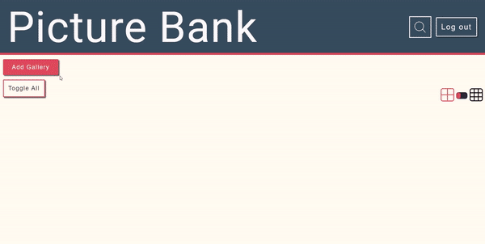

# Gallery App

Gallery app where you can bookmark your favourite images.

## Install

1. Make sure python 3 is installed
   -   Use `python --version` to check. If it is installed, you should see which version is installed.
   -   If it is not installed, install python (https://realpython.com/installing-python/)

2. Check pip is installed with `pip --version`

3. Set up the mysql database and run the sql script in .Admin/Release Scripts

4. Rename `src/config_template.py` to `src/config.py` and populate the database attributes

5. Check node is installed with `npm --version`. If not, install node.js

6. Run `setup.bat`

7. Run `start_server.bat`

8. Run `start_website.bat`

## Demo

 
